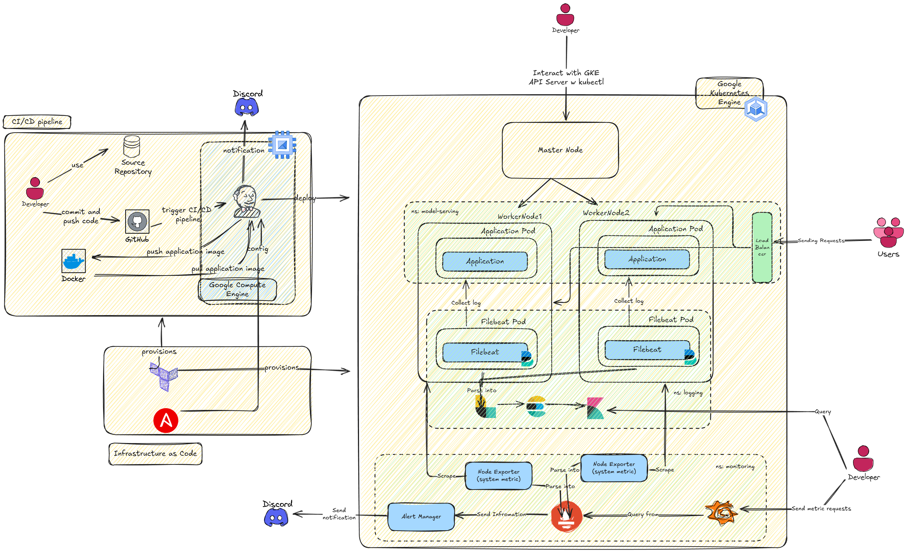

Introduction
==============================

Demand Forecasting task in supply chain is a very important (+ critical). A good forecasting system not only help you to increase service level, but also help you with decrease your inventory holding cost - This is based on the supply chain triangle


Table of Content
==============================


Repository Structure
==============================
<!-- Project Organization
------------

```
demandForecasting/
├── LICENSE     
├── README.md                  
├── Makefile                     # Makefile with commands like `make data` or `make train`                   
├── configs                      # Config files (models and training hyperparameters)
│   └── model1.yaml              
│
├── data                         
│   ├── external                 # Data from third party sources.
│   ├── interim                  # Intermediate data that has been transformed.
│   ├── processed                # The final, canonical data sets for modeling.
│   └── raw                      # The original, immutable data dump.
│
├── docs                         # Project documentation.
│
├── models                       # Trained and serialized models.
│
├── notebooks                    # Jupyter notebooks.
│
├── references                   # Data dictionaries, manuals, and all other explanatory materials.
│
├── reports                      # Generated analysis as HTML, PDF, LaTeX, etc.
│   └── figures                  # Generated graphics and figures to be used in reporting.
│
├── requirements.txt             # The requirements file for reproducing the analysis environment.
└── src                          # Source code for use in this project.
    ├── __init__.py              # Makes src a Python module.
    │
    ├── data                     # Data engineering scripts.
    │   ├── build_features.py    
    │   ├── cleaning.py          
    │   ├── ingestion.py         
    │   ├── labeling.py          
    │   ├── splitting.py         
    │   └── validation.py        
    │
    ├── models                   # ML model engineering (a folder for each model).
    │   └── model1      
    │       ├── dataloader.py    
    │       ├── hyperparameters_tuning.py 
    │       ├── model.py         
    │       ├── predict.py       
    │       ├── preprocessing.py 
    │       └── train.py         
    │
    └── visualization        # Scripts to create exploratory and results oriented visualizations.
        ├── evaluation.py        
        └── exploration.py       
```


-------- -->
<p><small>Project based on the <a target="_blank" href="https://github.com/Chim-SO/cookiecutter-mlops/">cookiecutter MLOps project template</a>
that is originally based on <a target="_blank" href="https://drivendata.github.io/cookiecutter-data-science/">cookiecutter data science project template</a>. 
#cookiecuttermlops #cookiecutterdatascience</small></p>

High-level system architecture
==============================
Looking at a high-level view, this is what the system look like:



Guide to install and run code
==============================
## 1. To get data.
For learning purpose, the data is already in here :), it is small tho. However, you can reference to this [link](https://www.kaggle.com/datasets/aswathrao/demand-forecasting) for more detail.
## Setup related to the 
## Setup related to the Virtual Machine


## Setup related to the Kubernetes Cluster
### 1. Connect to K8s - grant permssion via bind
```shell
gcloud auth login
gcloud container clusters get-credentials application-gke --zone us-central1-a --project global-phalanx-449403-d2
kubectl create ns model-serving
kubectl create clusterrolebinding model-serving-admin-binding \
  --clusterrole=admin \
  --serviceaccount=model-serving:default \
  --namespace=model-serving

kubectl create clusterrolebinding anonymous-admin-binding \
  --clusterrole=admin \
  --user=system:anonymous \
  --namespace=model-serving
```
### 2. Build the application with helm
```shell
kubens model-serving
# Use helm to deploy the application 
helm install application ./helm-charts/application 
# Wait for around 3 minutes then check for the external ip
kubectl get svc -n model-serving -w # ctrl c when the external ip appear
curl http://<external-ip>:8000/docs # to check if swagger is up
```
Remember that for these to work, the time zone/time must be the same as other people
### 3. Build the elk stack for logging
```shell
# now create ns for logging
kubectl create namespace logging
kubens logging  
# deploy the elk stack
helm install elasticsearch elastic/elasticsearch -f ./helm-charts/elk/elasticsearch-values.yaml
helm install filebeat elastic/filebeat -f ./helm-charts/elk/filebeat-values.yaml
helm install logstash elastic/logstash -f ./helm-charts/elk/logstash-values.yaml
helm install kibana elastic/kibana -f ./helm-charts/elk/kibana-values.yaml
# wait for about 5 minutues and then use port-forward to navigate to kibana
kubectl port-forward --namespace logging $(kubectl get pod --namespace logging --selector="app=kibana,release=kibana" --output jsonpath='{.items[0].metadata.name}') 8080:5601
# Now we need a username and the password. To get username:
kubectl get secret elasticsearch-master-credentials -o jsonpath="{.data.username}" | base64 --decode
# To get password: 
kubectl get secret elasticsearch-master-credentials -o jsonpath="{.data.password}" | base64 --decode
# Now navigate to the localhost:8080 and sign in with those credential
```
### 4. Now we build the monitoring w grafana and prometheus
```shell
kubectl create 
helm repo add prometheus-community https://prometheus-community.github.io/helm-charts
helm repo add stable https://charts.helm.sh/stable
helm repo update
helm pull prometheus-community/kube-prometheus-stack --version 45.7.1
tar -xzf kube-prometheus-stack-45.7.1.tgz
rm kube-prometheus-stack-45.7.1.tgz
helm install monitoring ./kube-prometheus-stack/
```

Link to a demo video
==============================

[def]: img/image-1.png