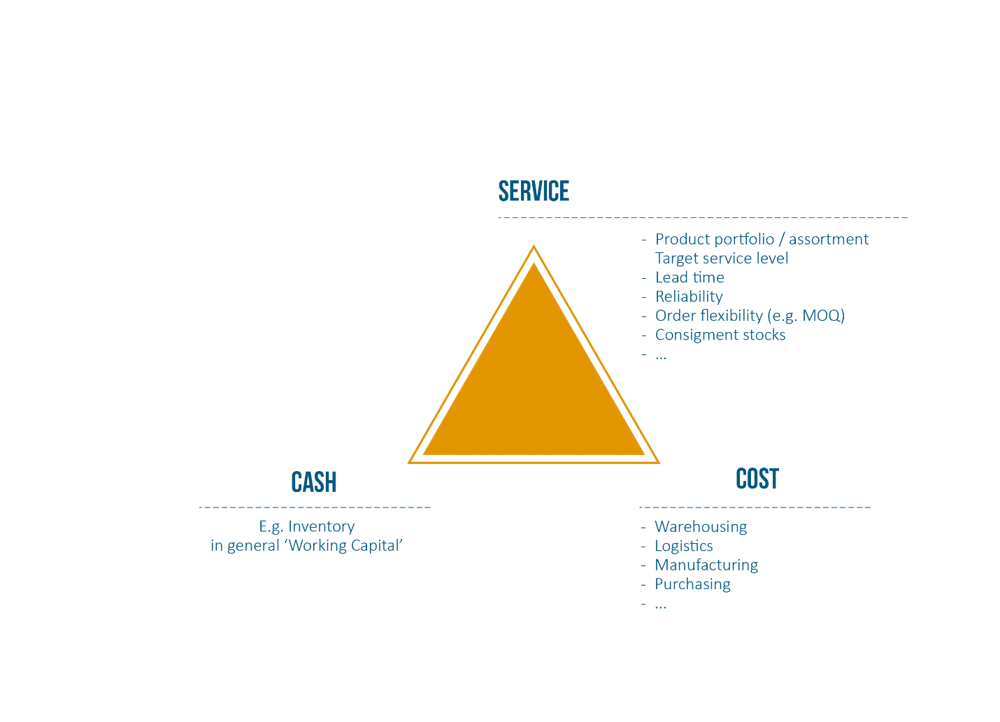

Introduction
==============================

Demand Forecasting task in supply chain is a very important (+ critical). A good forecasting system not only help you to increase service level, but also help you with decrease your inventory holding cost - This is based on the supply chain triangle


Table of Content
==============================


Repository Structure
==============================
<!-- Project Organization
------------

```
demandForecasting/
├── LICENSE     
├── README.md                  
├── Makefile                     # Makefile with commands like `make data` or `make train`                   
├── configs                      # Config files (models and training hyperparameters)
│   └── model1.yaml              
│
├── data                         
│   ├── external                 # Data from third party sources.
│   ├── interim                  # Intermediate data that has been transformed.
│   ├── processed                # The final, canonical data sets for modeling.
│   └── raw                      # The original, immutable data dump.
│
├── docs                         # Project documentation.
│
├── models                       # Trained and serialized models.
│
├── notebooks                    # Jupyter notebooks.
│
├── references                   # Data dictionaries, manuals, and all other explanatory materials.
│
├── reports                      # Generated analysis as HTML, PDF, LaTeX, etc.
│   └── figures                  # Generated graphics and figures to be used in reporting.
│
├── requirements.txt             # The requirements file for reproducing the analysis environment.
└── src                          # Source code for use in this project.
    ├── __init__.py              # Makes src a Python module.
    │
    ├── data                     # Data engineering scripts.
    │   ├── build_features.py    
    │   ├── cleaning.py          
    │   ├── ingestion.py         
    │   ├── labeling.py          
    │   ├── splitting.py         
    │   └── validation.py        
    │
    ├── models                   # ML model engineering (a folder for each model).
    │   └── model1      
    │       ├── dataloader.py    
    │       ├── hyperparameters_tuning.py 
    │       ├── model.py         
    │       ├── predict.py       
    │       ├── preprocessing.py 
    │       └── train.py         
    │
    └── visualization        # Scripts to create exploratory and results oriented visualizations.
        ├── evaluation.py        
        └── exploration.py       
```


-------- -->
<p><small>Project based on the <a target="_blank" href="https://github.com/Chim-SO/cookiecutter-mlops/">cookiecutter MLOps project template</a>
that is originally based on <a target="_blank" href="https://drivendata.github.io/cookiecutter-data-science/">cookiecutter data science project template</a>. 
#cookiecuttermlops #cookiecutterdatascience</small></p>

High-level system architecture
==============================


Guide to install and run code
==============================
## 1. To get data:

## 2. Connect to K8s - grant permssion via bind
```shell
gcloud auth login
gcloud container clusters get-credentials application-gke --region us-central1 --project global-phalanx-449403-d2
kubectl create ns model-serving
kubectl create clusterrolebinding model-serving-admin-binding \
  --clusterrole=admin \
  --serviceaccount=model-serving:default \
  --namespace=model-serving

kubectl create clusterrolebinding anonymous-admin-binding \
  --clusterrole=admin \
  --user=system:anonymous \
  --namespace=model-serving

# Use helm to deploy the application 
helm install application ./helm-charts/hpp 
# Wait for around 3 minutes then check for the external ip
kubectl get svc -n model-serving
curl http://<external-ip>:8000/docs # to access the swagger
```

## 3. Setup credential on JenkinsVM

Link to a demo video
==============================

[def]: img/image-1.png